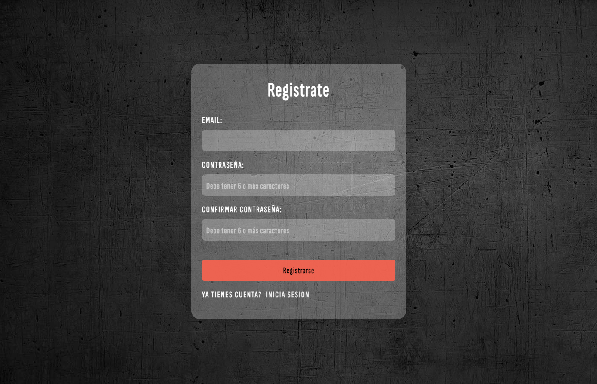

# SBEntrenamientos - Ecommerce
<a name="readme-top"></a>

<!-- TABLE OF CONTENTS -->
<details>
  <summary>Tabla de contenido</summary>
  <ol>
    <li>
      <a href="#sobre-el-proyecto">Sobre el Proyecto</a>
      <ul>
        <li><a href="#construido-con">Construido con</a></li>
      </ul>
    </li>
    <li>
      <a href="#comenzando">Comenzando</a>
      <ul>
        <li><a href="#pre-requisitos">Pre-requisitos</a></li>
        <li><a href="#instalación">Instalación</a></li>
      </ul>
    </li>
    <li><a href="#funcionalidades-del-proyecto">Funcionalidades del proyecto</a></li>
    <li><a href="#licencia">Licencia</a></li>
    <li><a href="#contacto">Contacto</a></li>
  </ol>
</details>

## Sobre el Proyecto
SBentrenamientos es un proyecto creado para la cursada REACT JS de CODERHOUSE. Basicamente es un ecommerce donde podes comprar indumentaria o equipamiento para poder hacer calistenia en tu casa o donde quieras.




### Construido con

Lista de Frameworks / Libraries que vas a necesitar

* [![React][React.js]][React-url]
* [![Node][Node.js]][Node-url]
* [![Firebase][Firebase.com]][Firebase-url]
* [![Laravel][Laravel.com]][Laravel-url]
* [![CSS3][Css3.com]][CSS3-url]
* [![VisualStudioCode][Visualstudio.com]][VSC-url]

<p align="right">(<a href="#readme-top"> Ir arriba </a>)</p>


## Comenzando 

Este proyecto fue creado con [Create React App](https://github.com/facebook/create-react-app).

Estas instrucciones te permitirán obtener una copia del proyecto en funcionamiento en tu máquina local para propósitos de desarrollo y pruebas.

Mira Deployment a continuación para conocer el proyecto.

[](https://react-js-pf-sdrigotti-rodrigo.vercel.app/)


#### Pre-requisitos 
Que cosas necesitas para instalar el software y como instalarlas:

Visual Studio Code + Firebase + Node js

#### Instalación 

Instrucciones para setear tu app.

1. Clonar el repositorio
   ```sh
   git clone https://github.com/rodrigosdrigotti/reactJS-PF-SdrigottiRodrigo.git
   ```
2. Install NPM packages para inicilizar y verlo en tu explorador en [http://localhost:3000](http://localhost:3000)
   ```sh
   npm install
   ```
3. Para la base de datos.
   ```sh
   npm install firebase
   ```
4. Para la carpeta de producción.
   ```sh
   npm install build
   ```

<p align="right">(<a href="#readme-top"> Ir arriba </a>)</p>

### Funcionalidades del proyecto

- `Funcionalidad 1`: Sistema de Registro y Login con recupero de contraseña
- `Funcionalidad 2`: Visualizacion de un set de productos
- `Funcionalidad 3`: Menu para filtrar categorías
- `Funcionalidad 4`: Acceso visible al carrito
- `Funcionalidad 5`: Acceso a la descripción de cada producto
- `Funcionalidad 6`: Chequeo en stock cantidad de productos
- `Funcionalidad 7`: Formulario para la generación de orden
- `Funcionalidad 8`: Generación de orden de compra con id y nombre de usuario
- `Funcionalidad 9`: Generacion de Alertas

## Licencia

Distribuido bajo la licencia [MIT](https://choosealicense.com/licenses/mit/). Mirá `LICENSE.txt` para más información.

## Contacto

Rodrigo Sdrigotti - [@rodrigosdrigotti](https://www.github.com/rodrigosdrigotti)

Project Link: [https://github.com/rodrigosdrigotti/reactJS-PF-SdrigottiRodrigo.git](https://github.com/rodrigosdrigotti/reactJS-PF-SdrigottiRodrigo.git)

<p align="right">(<a href="#readme-top"> Ir arriba </a>)</p>

[React.js]: https://img.shields.io/badge/React-20232A?style=for-the-badge&logo=react&logoColor=61DAFB
[React-url]: https://reactjs.org/
[Node.js]: https://img.shields.io/badge/node.js-35495E?style=for-the-badge&logo=node.js&logoColor=4FC08D
[Node-url]: https://nodejs.org/es
[Firebase.com]: https://img.shields.io/badge/Firebase-FF6F00?style=for-the-badge&logo=firebase&logoColor=white
[Firebase-url]: https://firebase.google.com/
[Laravel.com]: https://img.shields.io/badge/Javascript-FF2D20?style=for-the-badge&logo=javascript&logoColor=white
[Laravel-url]: https://laravel.com
[Css3.com]: https://img.shields.io/badge/CSS3-563D7C?style=for-the-badge&logo=css3&logoColor=white
[CSS3-url]: https://www.w3.org/Style/CSS/Overview.en.html
[Visualstudio.com]: https://img.shields.io/badge/VSC-0769AD?style=for-the-badge&logo=visualstudiocode&logoColor=white
[VSC-url]: https://code.visualstudio.com

