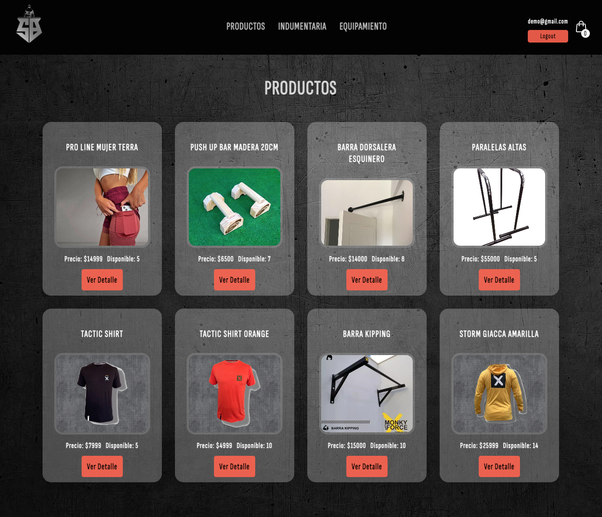

# SBEntrenamientos - Ecommerce

SBentrenamientos es un proyecto creado para la cursada REACT JS de CODERHOUSE. Basicamente es un ecommerce donde podes comprar indumentaria o equipamiento para poder hacer calistenia en tu casa o donde quieras.

## Comenzando 🚀 

Este proyecto fue creado con [Create React App](https://github.com/facebook/create-react-app).

Estas instrucciones te permitirán obtener una copia del proyecto en funcionamiento en tu máquina local para propósitos de desarrollo y pruebas.

Mira Deployment a continuación para conocer como desplegar el proyecto.

#### Pre-requisitos 📋 
Que cosas necesitas para instalar el software y como instalarlas:

Visual Studio Code

### Instalación 🔧 

Instalar dependecias.
##### npm install

Para inicilizar y verlo en tu explorador en [http://localhost:3000](http://localhost:3000)
##### npm start

Para la carpeta de producción.
##### npm run build

Para la base de datos.
##### npm install firebase

### Funcionalidades del proyecto :hammer:

- `Funcionalidad 1`: Visualizacion de un set de productos
- `Funcionalidad 2`: Menu para filtrar categorías
- `Funcionalidad 3`: Acceso visible al carrito
- `Funcionalidad 4`: Acceso a la descripción de cada producto
- `Funcionalidad 5`: Chequeo en stock cantidad de productos
- `Funcionalidad 6`: Formulario para la generación de orden
- `Funcionalidad 7`: Generación de orden de compra con id y detalle de productos

